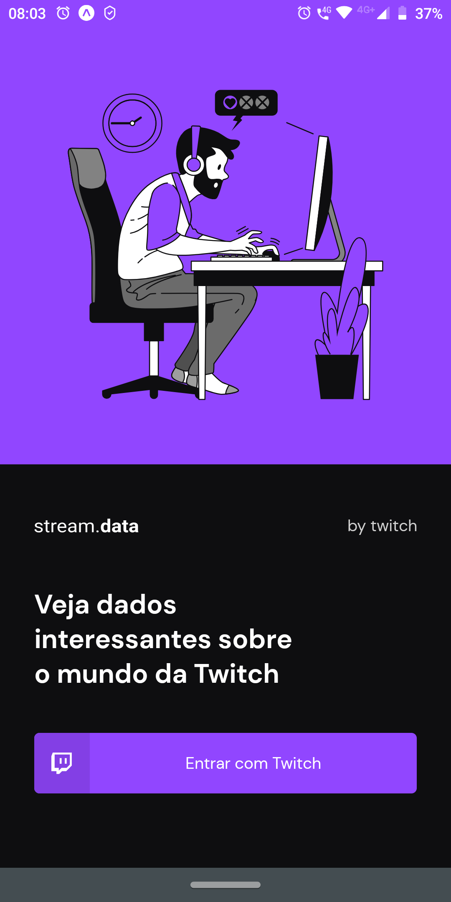

# stream.data 
<p align="center"></p>

> **Info**: Projeto desenvolvido durante o desafio do Chapter II - Trilha React Native com login social com a Twitch. Foi implementado todo o fluxo de login e logout utilizando o OAuth da Twitch. { [Tema inicial clonado](https://github.com/rocketseat-education/ignite-template-react-native-stream-data) }
---
<br>

<p align="center">
  <a href="#-telas-da-aplicação">Telas</a>&nbsp;&nbsp;&nbsp;|&nbsp;&nbsp;&nbsp;
  <a href="#-tecnologias-usadas">Tecnologias</a>&nbsp;&nbsp;&nbsp;|&nbsp;&nbsp;&nbsp;
  <a href="#-Funcionalidades">Funcionalidades</a>&nbsp;&nbsp;&nbsp;|&nbsp;&nbsp;&nbsp;
  <a href="#-clonando-o-projeto-para-sua-máquina">Clonando</a>&nbsp;&nbsp;&nbsp;
  |&nbsp;&nbsp;&nbsp;
  <a href="#-como-executar-o-projeto-em-seu-celular-usando-o-expo">Executando</a>&nbsp;&nbsp;&nbsp;|&nbsp;&nbsp;&nbsp;
  <a href="#-dúvidas">Dúvidas</a>&nbsp;&nbsp;&nbsp;|&nbsp;&nbsp;&nbsp;
  <a href="#-licença-mit">Licença</a>
</p>

---
<br/>
<p align="center">

<br/><br/>

# 🔄 Telas da aplicação
<br/>

## Página login

<p align="center"></p>
<br>
<br>
<br>

## Página home
<p align="center">
</p>

<br/><br>

## 🎨 Funcionalidades
---
- Login social com a Twitch. 
- Atualizar a tela sem necessidade de reload na aplicação.
- Lista todos os canais ao vivo que vc segue.
- Lista os canais mais assistidos da Twitch.
- Logout para limpar informações de login da aplicação.

<br/><br>

# 🏇 Tecnologias usadas
- [React Native](https://reactnative.dev/)
- [Expo](https://expo.dev/)
- [Axios ](https://axios-http.com/)
- [Moti](https://moti.fyi/)
- [Google Fonts](https://fonts.google.com/)
- [Styled-components](https://styled-components.com/)
- [TypeScript](https://www.typescriptlang.org/)
- [Babel](https://babeljs.io/)

<br/><br>

## 💻 Clonando o projeto para sua máquina
---
1. Abra o terminal de seu computador.
2. Acessar a pasta de seus projetos. 
3. Estando dentro da pasta de seus projetos, execute os comandos abaixo:
```bash
# Para fazer o download do projeto para seu computador
$ git clone https://github.com/andrelinos/stream-data.git

# Entrar na pasta do projeto 
$ cd stream-data

# Para baixar as dependências do projeto
$ yarn

# Abra com o editor vscode
$ code .
```
4. Pronto, agora basta testar e fazer as alterações que desejar.
  
<br/><br>

## 🔥 Como executar o projeto em seu celular usando o expo
---
1. Copie e renomeie o arquivo `.env.example para` para `.env`.
2. Acesse a Twitch e acesse sua conta, ou caso tenha uma, faça o login. 
3. Vá para o link [https://dev.twitch.tv/console/apps/create](https://dev.twitch.tv/console/apps/create) para registar uma nova aplicação.
- **Name**: Dê um nome para sua aplicação.
- **URLs de redirecionamento OAuth**: https://auth.expo.io/@seu-user/nomeSeuApp
- - **Notas**:
- - @seu-user: Para pegar seu nome de usuário acesse seu perfil [https://www.twitch.tv/settings/profile](https://www.twitch.tv/settings/profile).
- - Para pegar o nome da sua aplicação, acesse o arquivo `app.json` na instrução `"slug": "streamData",`. Caso não tenha esta linha, insira-a. 
- **Categoria**: Selecione `Application Integration`
- Marque que você não é um Droid.
- Clique no botão Criar. 
- Após este passo você verá seu **ID do cliente**, basta copiá-lo para o arquivo `.env` que você copiou e renomeou antes.

4. Agora dentro da pasta da aplicação pelo terminal, execute o comando abaixo: 
```bash
# Este comando disponibilizar o projeto para ser aberto pelo aplicativo expo que 
# você precisa de instalar em seu dispositivo físico ou no emulador. 
$ expo start
```
5. Em seguida, com o aplicativo **Expo Go** instalado em seu smartphone, basta ler o QRCode que aparece na tela do computador. 
   
<br>

> **Nota**: Seu celular e o computador devem estar na mesma rede wi-fi e na mesma faixa de IP para que funcione o aplicativo entre seu computador e seu celular. 

<br/><br>

## ✔️ Dúvidas
---
Se você tive alguma dúvida, poderá entrar em contato comigo aqui [andrelino.dev](https://andrelino.dev).

<br /><br />

> **Quer ser dev? [Acesse aqui!](https://app.rocketseat.com.br/discover)**
> ---
>  


<br /><br />

## 📄 Licença MIT
---


- Consulte a [LICENÇA](LICENSE) para mais informações.
<br/><br>

---
<p align="center"> Made with 💜 by [Andrelino Silva](https://github.com/andrelinos/)</p>